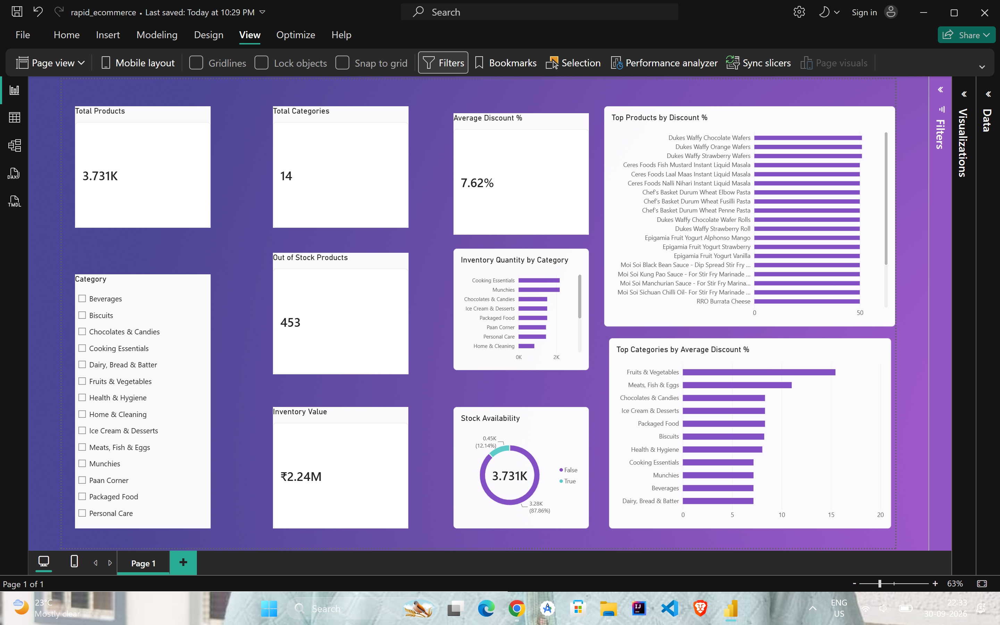
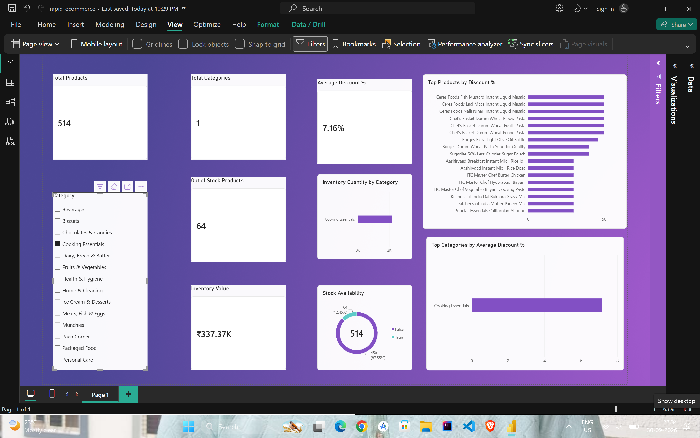

# Rapid E-Commerce Data Analysis

An end-to-end e-commerce data analysis project using **PostgreSQL** and **Power BI** to analyze products, pricing, discounts, inventory, and stock availability.

## Dashboard Preview

## Interactive Dashboard

The dashboard includes category-level filtering for interactive analysis.

## Tools & Technologies

- PostgreSQL
- SQL
- Power BI
- DAX

## Analysis Performed

- Product and category analysis
- Discount analysis
- Inventory quantity analysis
- Stock availability analysis
- Inventory value calculation
- Price and weight analysis
- Category-level discount comparison
- Out-of-stock product analysis

## Key Metrics

- **3,731+ Products**
- **14 Categories**
- **7.62% Average Discount**
- **453 Out-of-Stock Products**
- **₹2.24M Inventory Value**

## Project Files

- `rapid_ecommerce_analysis.sql` — SQL queries for data exploration, cleaning, and analysis
- `rapid_ecommerce.pbix` — Power BI dashboard
- `image1.png` — Dashboard overview
- `image2.png` — Filtered dashboard view

## Project Objective

The goal of this project was to transform raw e-commerce product data into meaningful business insights using SQL and an interactive Power BI dashboard.
